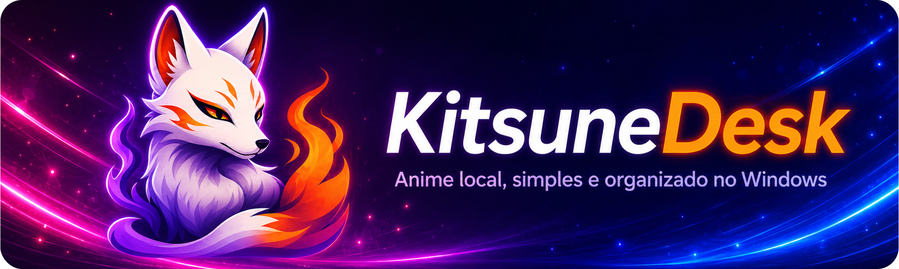
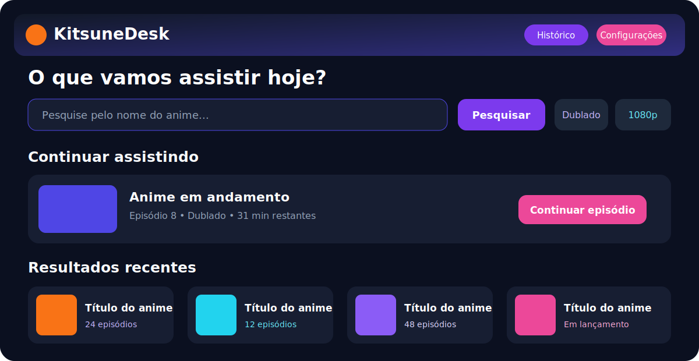
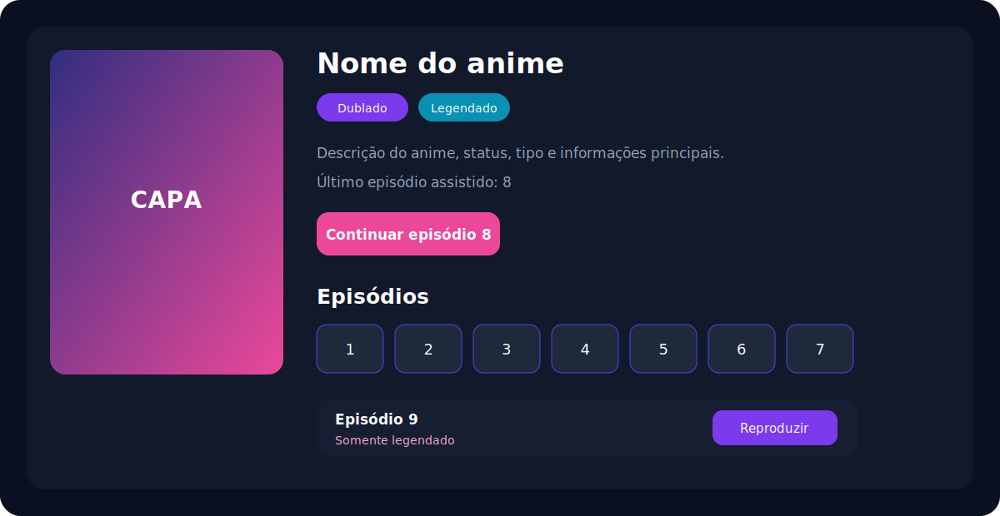
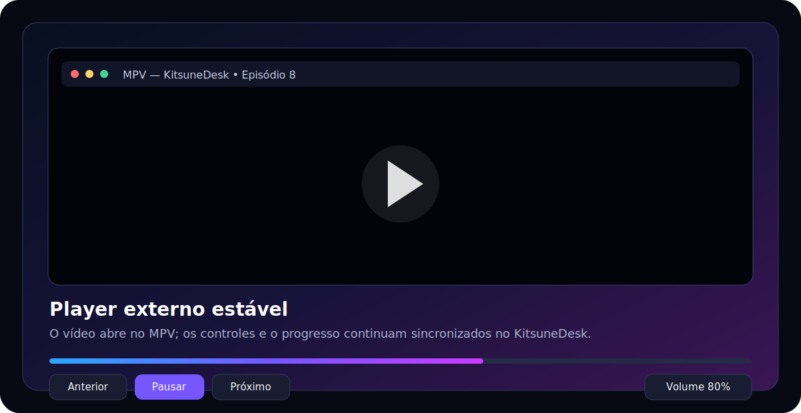
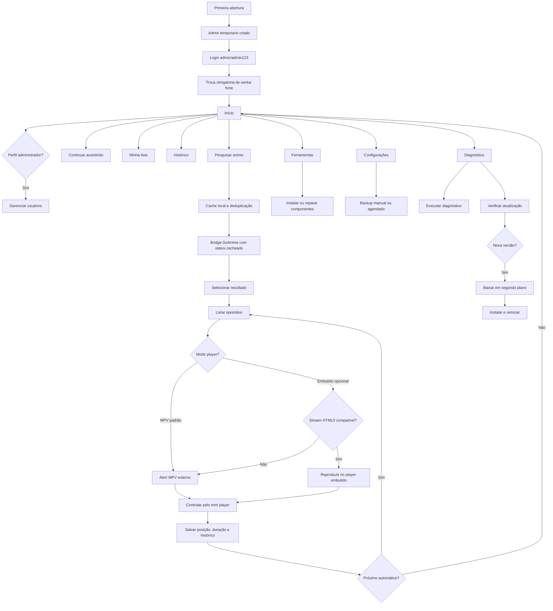

<p align="center">
  
</p>

<h1 align="center">KitsuneDesk v0.14.0 Stable</h1>

<p align="center">
  Aplicativo desktop para pesquisar, assistir e acompanhar animes com perfis locais, biblioteca individual, busca mais rápida e reprodução estável com MPV externo como padrão.
</p>

<p align="center">
  <a href="https://github.com/RaphaelTW/kitsuneDesk/releases/latest"></a>
  <a href="https://github.com/RaphaelTW/kitsuneDesk/actions/workflows/windows-build.yml"></a>
  <a href="LICENSE"></a>
  
  
</p>

> O KitsuneDesk não hospeda, armazena, transmite, vende nem distribui vídeos, episódios ou streams. Ele apenas consulta conteúdo já disponibilizado por provedores online independentes e reúne os acessos em uma única interface. Disponibilidade, direitos, legalidade e termos de uso pertencem a cada provedor e à responsabilidade do usuário.

## Navegação rápida

[Novidades](#novidades-da-versão-0140) · [Fluxo](#fluxo-do-sistema) · [Recursos](#recursos) · [Instalação](#executar-em-desenvolvimento) · [Release](#publicar-a-versão-0140) · [Limitações](#limitações-conhecidas)

## Novidades da versão 0.14.0

A v0.14.0 pula a série 0.13 e fecha as melhorias planejadas no README anterior, com foco em velocidade, distribuição segura e instalação mais transparente.

- busca e verificação de provedores mais rápidas: cache do status do bridge GoAnime, timeout curto na checagem, deduplicação de pesquisas simultâneas e reaproveitamento de cache local/stale;
- sistema mais rápido ao abrir e pesquisar: o app evita revalidar binários externos a cada ação, reduz probes de rede longos e mantém resultados de pesquisa/episódios em cache com expiração;
- player embutido opcional mais seguro: arquivos diretos compatíveis (`mp4`, `webm`, `ogg`) podem abrir no HTML5, mas HLS, headers especiais e formatos incertos voltam automaticamente para o MPV externo;
- MPV externo continua sendo o padrão recomendado e o fallback estável para maior compatibilidade;
- backups criptografados agendados: frequência diária, semanal ou mensal, diretório configurável, opção de incluir perfis locais com senha protegida pelo cofre do Windows e validação automática do backup gerado;
- importação/exportação preserva biblioteca, temas, provedores, modo do player, idioma da interface e preferências locais sem exportar segredos como PIN parental ou senha criptografada do agendamento;
- pacotes offline opcionais de provedores agora têm manifesto com SHA-256 e suporte a assinatura Ed25519 do manifesto em releases;
- workflow de release testa atualização instalada a partir da versão anterior, valida rollback e simula recuperação após download interrompido;
- instalador NSIS exibe termos obrigatórios antes de instalar, com aviso claro de que o KitsuneDesk não hospeda nada e apenas integra provedores online já existentes;
- termos do instalador em português com resumo em inglês e configuração para idiomas `pt_BR` e `en_US`;
- assinatura Authenticode obrigatória no pipeline de release com `WINDOWS_CSC_LINK` e `WINDOWS_CSC_KEY_PASSWORD`, validação por `Get-AuthenticodeSignature` e bloqueio da publicação se a assinatura estiver ausente.

> Importante sobre o Windows Defender/SmartScreen: o projeto agora exige assinatura digital no pipeline, mas o Windows só deixa de mostrar alertas de editor desconhecido quando o instalador é assinado com um certificado Authenticode válido e ganha reputação. Sem certificado real configurado nos secrets, nenhuma alteração de código consegue garantir que o Windows reconheça o arquivo como seguro.

Também permanecem disponíveis os recursos entregues nas séries 0.11 e 0.12:

- temas Older Brother Core, Dreamcore, Cottagecore, Cyberpunk e Synthwave;
- snapshot local da Home, preferências e mini player para exibir a interface imediatamente ao abrir;
- hidratação assíncrona de informações do app, configurações, biblioteca, playback e atualização;
- aquecimento em segundo plano do cache de capas exibidas na Home;
- cache offline dos avatares selecionados também no renderer;
- backup da biblioteca em JSON com restauração por mesclagem ou substituição;
- backup criptografado de perfis usando `scrypt` e `AES-256-GCM`;
- gerenciamento visual da telemetria local com filtros, paginação, exclusão e exportação;
- atualização automática compatível com `latest.yml`, `.blockmap` e instalador NSIS.

## Prévia

<table>
  <tr>
    <td align="center"><strong>Início</strong></td>
    <td align="center"><strong>Pesquisa e episódios</strong></td>
  </tr>
  <tr>
    <td><a href="assets/home-preview.svg"></a></td>
    <td><a href="assets/anime-preview.svg"></a></td>
  </tr>
  <tr>
    <td colspan="2" align="center"><strong>Player MPV externo com controles no aplicativo</strong></td>
  </tr>
  <tr>
    <td colspan="2" align="center"><a href="assets/player-preview.svg"></a></td>
  </tr>
</table>

## Primeiro acesso

O primeiro acesso usa uma senha temporária:

```text
usuario: admin
senha: admin123
```

Depois do login, o KitsuneDesk exige a troca imediata. A nova senha deve ter pelo menos oito caracteres, uma letra maiúscula, uma letra minúscula, um número e um caractere especial. Depois disso, somente administradores podem cadastrar outros usuários.

<details>
<summary><strong>O que fica separado por usuário?</strong></summary>

- histórico e posição dos episódios;
- favoritos e lista Quero assistir;
- idioma, qualidade, volume e reprodução automática;
- tema, controle parental e classificação máxima;
- estatísticas e atividade recente.

</details>

## Fluxo do sistema



### Fluxo interativo

Abra **[`docs/fluxo-interativo.html`](docs/fluxo-interativo.html)** no navegador para navegar pelos cartões e filtrar reprodução, usuários, segurança, instalação e atualização.

## Recursos

| Área | Recursos principais |
|---|---|
| Reprodução | MPV externo padrão, player embutido opcional, fallback automático, pausa, volume, busca, progresso, anterior, próximo e retomada |
| Biblioteca | Continuar assistindo, favoritos, Quero assistir, histórico e estatísticas |
| Pesquisa | GoAnime GUI, cache local, deduplicação de chamadas, idioma, resolução, episódios, capas e fallback de fontes |
| Administração | Usuários, funções, ativação, redefinição de senha e proteção do último administrador |
| Segurança | Bloqueio após tentativas inválidas, PIN parental, CSP, sandbox, isolamento de contexto, termos do instalador e assinatura de release |
| Manutenção | Diagnóstico, reparo, limpeza de cache, relatório técnico, backup agendado e atualização automática |

<details>
<summary><strong>Provedores e ferramentas</strong></summary>

| Item | Situação | Finalidade |
|---|---|---|
| GoAnime GUI | Recomendado | Pesquisa, episódios, fallback e reprodução sem terminal |
| GoAnime clássico | Alternativo | Fluxo original em terminal |
| anime-cli-br | Legado | Alternativa brasileira baseada em fonte externa |
| ani-cli | Experimental | Alternativa sujeita a falhas dos provedores upstream |
| FAST Anime VSR | Ferramenta | Processamento e melhoria de vídeos locais |

</details>

## Modos do player

O MPV externo continua selecionado por padrão. O KitsuneDesk se conecta a ele por IPC para atualizar o progresso e executar os controles. Nas configurações, o usuário pode optar pelo player embutido experimental.

```text
KitsuneDesk resolve o stream
        ↓
Se for arquivo direto compatível, pode abrir no player HTML5
        ↓
Se for HLS, exigir headers ou formato incerto, volta para o MPV externo
        ↓
IPC acompanha posição, duração e estado
        ↓
SQLite salva o progresso por usuário
```

Esse modelo mantém o MPV como caminho estável e reduz incompatibilidades com codecs, HLS, cabeçalhos HTTP especiais, drivers e composição de janelas do Windows.

## Executar em desenvolvimento

Requisitos recomendados:

- Windows 10 ou 11 x64;
- Node.js 24;
- npm 11;
- Git.

```powershell
npm install
npm run dev
```

### Validar antes de enviar alterações

```powershell
npm run validate
```

O comando executa:

```text
ESLint → Prettier Check → Testes unitários e de integração
```

Comandos individuais:

```powershell
npm run lint
npm run format:check
npm test
npm run test:e2e:electron
npm run rebuild:native
```

## Gerar o instalador do Windows

```powershell
npm install
npm run validate
npm run release:win
```

Arquivo esperado:

```text
dist\KitsuneDesk-Setup-0.14.0.exe
```

Para uma release pública assinada, configure antes no GitHub Actions:

```text
WINDOWS_CSC_LINK
WINDOWS_CSC_KEY_PASSWORD
PROVIDER_MANIFEST_PRIVATE_KEY
PROVIDER_MANIFEST_PUBLIC_KEY opcional
```

`WINDOWS_CSC_LINK` precisa apontar para um certificado Authenticode válido, normalmente em `.p12`/`.pfx` codificado em base64 ou URL segura compatível com o `electron-builder`. Sem esse certificado, o instalador até pode ser gerado localmente, mas a release marcada por tag deve falhar por segurança.

## Publicar a versão 0.14.0

```powershell
git status
git add .
git commit -m "feat: publica KitsuneDesk v0.14.0 com performance e release segura"
git push origin main

git tag -a v0.14.0 -m "KitsuneDesk v0.14.0"
git push origin v0.14.0
```

O GitHub Actions valida o código, cria a Release e publica:

```text
KitsuneDesk-Setup-0.14.0.exe
KitsuneDesk-Setup-0.14.0.exe.blockmap
latest.yml
```

O workflow interrompe a publicação se qualquer arquivo estiver ausente, vazio, apontando para uma versão incorreta, se o instalador não estiver assinado ou se o manifesto dos provedores offline não puder ser assinado em uma tag de release.

Se precisar criar a Release manualmente depois de subir a tag:

```powershell
gh release create v0.14.0 `
  --repo RaphaelTW/kitsuneDesk `
  --title "KitsuneDesk v0.14.0" `
  --notes "KitsuneDesk v0.14.0: busca e verificação mais rápidas, backup criptografado agendado, player embutido com fallback para MPV, termos obrigatórios no instalador, manifesto assinado dos provedores offline e release Windows assinada." `
  --latest
```

Para anexar os artefatos gerados localmente:

```powershell
gh release upload v0.14.0 .\dist\KitsuneDesk-Setup-0.14.0.exe .\dist\KitsuneDesk-Setup-0.14.0.exe.blockmap .\dist\latest.yml `
  --repo RaphaelTW/kitsuneDesk `
  --clobber
```

## Estrutura principal

```text
src/main/
  controllers/       controladores da aplicação
  database/          SQLite e migrações
  ipc/               canais seguros entre renderer e processo principal
  repositories/      acesso e persistência de dados
  services/          autenticação, player, biblioteca, diagnóstico, backup e atualização
src/renderer/
  pages/              login, troca de senha e aplicação principal
  js/                 interface, eventos e componentes
  css/                layout, temas e animações
resources/
  goanime-bridge/     bridge Go e inicialização do MPV externo
  providers/          componentes instalados localmente e manifesto offline
scripts/windows/      instalação e reparo de dependências
scripts/              validações de release, assinatura, provedores e update instalado
docs/                 fluxo interativo e termos do instalador
tests/                testes unitários, integração e E2E Electron
.github/workflows/    validação, build, assinatura e releases
```

## Melhorias recomendadas para as próximas versões

- adicionar módulo opcional com `hls.js`/MSE para ampliar suporte do player embutido sem remover o MPV padrão;
- gerar SBOM assinado e anexar hashes públicos de todos os artefatos da release;
- adicionar painel de reputação/diagnóstico do instalador com instruções para certificado EV/OV e SmartScreen;
- permitir destino de backup em nuvem escolhido pelo usuário, mantendo criptografia local antes do envio;
- expandir a tradução completa da interface, mensagens de erro e documentação para mais idiomas;
- criar testes E2E de busca com provedores simulados para medir regressões de tempo de resposta sem depender de fontes externas reais.

## Limitações conhecidas

- episódios e streams dependem de fontes externas;
- o KitsuneDesk não hospeda nada e não controla disponibilidade, legalidade, qualidade ou termos dos provedores online;
- o MPV abre em uma janela separada quando usado como padrão/fallback;
- o player embutido não é recomendado para HLS, headers especiais ou codecs não suportados pelo Chromium;
- serviços oficiais com DRM são abertos no navegador;
- o FAST Anime VSR depende de hardware, driver e runtime compatíveis;
- o atualizador automático funciona em instalações geradas por uma Release pública;
- Windows Defender/SmartScreen podem continuar exibindo alerta até a assinatura Authenticode ter certificado válido e reputação suficiente;
- o modo de desenvolvimento não executa a instalação automática de atualizações.

## Licença

Distribuído sob a licença MIT. Consulte [`THIRD_PARTY.md`](THIRD_PARTY.md) para os componentes e projetos de terceiros.
