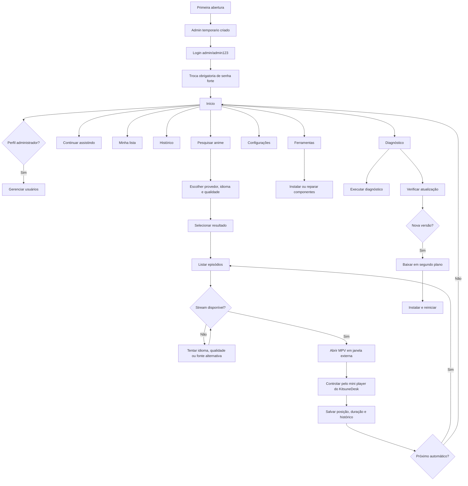

<p align="center">
  
</p>

<h1 align="center">KitsuneDesk v0.9.0 Stable</h1>

<p align="center">
  Aplicativo desktop para pesquisar, assistir e acompanhar animes com perfis locais, biblioteca individual e reprodução estável em uma janela externa do MPV.
</p>

<p align="center">
  <a href="https://github.com/RaphaelTW/kitsuneDesk/releases/latest"></a>
  <a href="https://github.com/RaphaelTW/kitsuneDesk/actions/workflows/windows-build.yml"></a>
  <a href="LICENSE"></a>
  
  
</p>

> O KitsuneDesk não hospeda vídeos. A disponibilidade de títulos, idiomas, episódios e fontes depende dos projetos e serviços externos utilizados.

## Navegação rápida

[Novidades](#novidades-da-versão-090) · [Fluxo](#fluxo-do-sistema) · [Recursos](#recursos) · [Instalação](#executar-em-desenvolvimento) · [Release](#publicar-a-versão-090) · [Limitações](#limitações-conhecidas)

## Novidades da versão 0.9.0

Esta versão transforma os itens planejados em recursos de produto e endurece o caminho de release do Windows.

- primeiro usuário local criado automaticamente como `admin` / `admin123`, com troca obrigatória no primeiro login;
- nova senha exige pelo menos oito caracteres, letra maiúscula, letra minúscula, número e caractere especial;
- fila de reprodução com reordenação por botões acessíveis;
- exportação do histórico filtrado em CSV;
- telemetria local de falhas, desativada por padrão e controlada nas configurações;
- avatares de usuário via DiceBear, guardando apenas estilo e semente;
- teste end-to-end do Electron no Windows com Playwright;
- release Windows preparada para assinatura digital por certificado via secrets `WINDOWS_CSC_LINK` e `WINDOWS_CSC_KEY_PASSWORD`;
- verificação de integridade dos binários baixados por SHA-256 publicado ou assinatura Authenticode;
- melhorias de navegação por teclado, foco visível, `aria-current`, skip link e rótulos para leitores de tela.

A reprodução permanece estável em uma janela externa do MPV, com controles integrados no KitsuneDesk.

## Prévia

<table>
  <tr>
    <td align="center"><strong>Início</strong></td>
    <td align="center"><strong>Pesquisa e episódios</strong></td>
  </tr>
  <tr>
    <td><a href="assets/home-preview.svg"></a></td>
    <td><a href="assets/anime-preview.svg"></a></td>
  </tr>
  <tr>
    <td colspan="2" align="center"><strong>Player MPV externo com controles no aplicativo</strong></td>
  </tr>
  <tr>
    <td colspan="2" align="center"><a href="assets/player-preview.svg"></a></td>
  </tr>
</table>

## Primeiro acesso

O primeiro acesso usa uma senha temporária:

```text
usuario: admin
senha: admin123
```

Depois do login, o KitsuneDesk exige a troca imediata. A nova senha deve ter pelo menos oito caracteres, uma letra maiúscula, uma letra minúscula, um número e um caractere especial. Depois disso, somente administradores podem cadastrar outros usuários.

<details>
<summary><strong>O que fica separado por usuário?</strong></summary>

- histórico e posição dos episódios;
- favoritos e lista Quero assistir;
- idioma, qualidade, volume e reprodução automática;
- tema, controle parental e classificação máxima;
- estatísticas e atividade recente.

</details>

## Fluxo do sistema



### Fluxo interativo

Abra **[`docs/fluxo-interativo.html`](docs/fluxo-interativo.html)** no navegador para navegar pelos cartões e filtrar reprodução, usuários, segurança, instalação e atualização.

## Recursos

| Área | Recursos principais |
|---|---|
| Reprodução | MPV externo, pausa, volume, busca, progresso, anterior, próximo e retomada |
| Biblioteca | Continuar assistindo, favoritos, Quero assistir, histórico e estatísticas |
| Pesquisa | GoAnime GUI, idioma, resolução, episódios, capas e fallback de fontes |
| Administração | Usuários, funções, ativação, redefinição de senha e proteção do último administrador |
| Segurança | Bloqueio após tentativas inválidas, PIN parental, CSP, sandbox e isolamento de contexto |
| Manutenção | Diagnóstico, reparo, limpeza de cache, relatório técnico e atualização automática |

<details>
<summary><strong>Provedores e ferramentas</strong></summary>

| Item | Situação | Finalidade |
|---|---|---|
| GoAnime GUI | Recomendado | Pesquisa, episódios, fallback e reprodução sem terminal |
| GoAnime clássico | Alternativo | Fluxo original em terminal |
| anime-cli-br | Legado | Alternativa brasileira baseada em fonte externa |
| ani-cli | Experimental | Alternativa sujeita a falhas dos provedores upstream |
| FAST Anime VSR | Ferramenta | Processamento e melhoria de vídeos locais |

</details>

## Player Stable

O vídeo é exibido pela janela tradicional do MPV. O KitsuneDesk continua conectado ao player por IPC para atualizar o progresso e executar os controles.

```text
KitsuneDesk resolve o stream
        ↓
Bridge inicia o MPV externo
        ↓
IPC acompanha posição, duração e estado
        ↓
Mini player envia pausa, volume, seek, anterior e próximo
        ↓
SQLite salva o progresso por usuário
```

Esse modelo reduz incompatibilidades com drivers, composição de janelas do Windows e superfícies nativas do Electron.

## Executar em desenvolvimento

Requisitos recomendados:

- Windows 10 ou 11 x64;
- Node.js 24;
- npm 11;
- Git.

```powershell
npm install
npm run dev
```

### Validar antes de enviar alterações

```powershell
npm run validate
```

O comando executa:

```text
ESLint → Prettier Check → Testes unitários e de integração
```

Comandos individuais:

```powershell
npm run lint
npm run format:check
npm test
npm run test:e2e:electron
npm run rebuild:native
```

## Gerar o instalador do Windows

```powershell
npm install
npm run validate
npm run build:win
```

Arquivo esperado:

```text
dist\KitsuneDesk-Setup-0.9.0.exe
```

## Publicar a versão 0.9.0

Antes de publicar uma tag, configure os secrets `WINDOWS_CSC_LINK` e `WINDOWS_CSC_KEY_PASSWORD` no GitHub Actions para assinar o instalador Windows.

```powershell
git add .
git commit -m "feat: prepara release v0.9.0"
git push origin main

git tag -a v0.9.0 -m "KitsuneDesk v0.9.0"
git push origin v0.9.0
```

O GitHub Actions valida o código, cria a Release e publica:

```text
KitsuneDesk-Setup-0.9.0.exe
KitsuneDesk-Setup-0.9.0.exe.blockmap
latest.yml
```

O workflow interrompe a publicação se qualquer arquivo estiver ausente, vazio, apontando para uma versão incorreta ou se a assinatura digital não estiver configurada.

<details>
<summary><strong>Publicar a próxima versão</strong></summary>

```powershell
npm version 0.9.1 --no-git-tag-version
npm run validate

git add .
git commit -m "chore: prepara release v0.9.1"
git push origin main

git tag -a v0.9.1 -m "KitsuneDesk v0.9.1"
git push origin v0.9.1
```

</details>

## Estrutura principal

```text
src/main/
  controllers/       controladores da aplicação
  database/          SQLite e migrações
  ipc/               canais seguros entre renderer e processo principal
  repositories/      acesso e persistência de dados
  services/          autenticação, player, biblioteca, diagnóstico e atualização
src/renderer/
  pages/              login, troca de senha e aplicação principal
  js/                 interface, eventos e componentes
  css/                layout, temas e animações
resources/
  goanime-bridge/     bridge Go e inicialização do MPV externo
  providers/          componentes instalados localmente
scripts/windows/      instalação e reparo de dependências
docs/                 fluxo interativo
tests/                testes unitários, integração e E2E Electron
.github/workflows/    validação, build e releases
```

## Melhorias recomendadas para as próximas versões

- cache local de resultados e capas com expiração;
- backup e restauração da biblioteca em JSON;
- backup criptografado opcional dos perfis locais;
- gerenciamento visual dos registros de telemetria local;
- cache offline dos avatares selecionados.

## Limitações conhecidas

- episódios e streams dependem de fontes externas;
- o MPV abre em uma janela separada nesta versão;
- serviços oficiais com DRM são abertos no navegador;
- o FAST Anime VSR depende de hardware, driver e runtime compatíveis;
- o atualizador automático funciona em instalações geradas por uma Release pública;
- o modo de desenvolvimento não executa a instalação automática de atualizações.

## Licença

Distribuído sob a licença MIT. Consulte [`THIRD_PARTY.md`](THIRD_PARTY.md) para os componentes e projetos de terceiros.
