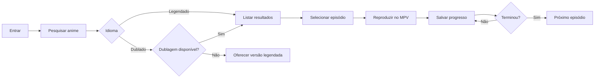
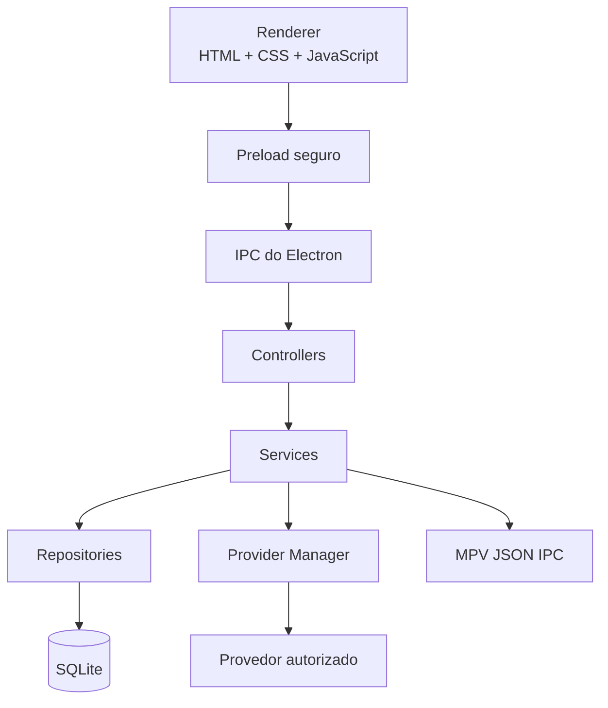
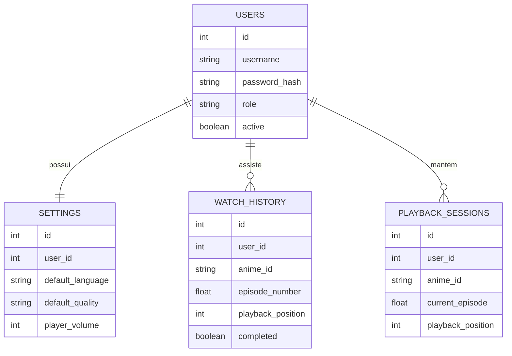

<div align="center">


<br>

[](#-requisitos)
[](#-tecnologias)
[](#-tecnologias)
[](#-tecnologias)
[](#-tecnologias)
[](#-player-mpv)

<br>

### Sua biblioteca de animes em uma experiência local, simples e organizada.

Pesquise títulos, escolha episódios, alterne entre legendado e dublado, continue de onde parou e controle o MPV sem precisar abrir o terminal.

<br>

[Visão geral](#-visão-geral) •
[Recursos](#-recursos) •
[Instalação](#-instalação) •
[Estrutura](#-estrutura-do-projeto) •
[Roadmap](#-roadmap) •
[FAQ](#-perguntas-frequentes)

</div>

---

## 🦊 Sobre o nome

**KitsuneDesk** combina:

- **Kitsune**: a raposa da cultura japonesa, associada a inteligência e agilidade.
- **Desk**: a experiência desktop local, instalada diretamente no Windows.

O nome é curto, memorável e representa bem uma aplicação moderna para organizar e reproduzir animes no computador.

---

## 🌈 Visão geral

O **KitsuneDesk** é uma aplicação desktop local para Windows criada com tecnologias web, mas executada como um programa tradicional.

A proposta é oferecer uma interface amigável para pessoas que não querem utilizar PowerShell, CMD, Git Bash ou comandos manuais para pesquisar e reproduzir episódios.

> O sistema funciona localmente, mantém os dados na máquina e não exige hospedagem pública.

<div align="center">


</div>

---

## ✨ Recursos

<table>
<tr>
<td width="50%" valign="top">

### 🔎 Descoberta

- Pesquisa por nome.
- Resultados em cards.
- Filtro legendado ou dublado.
- Seleção de qualidade.
- Detalhes do título.
- Lista de episódios.
- Aviso quando a dublagem não estiver disponível.

</td>
<td width="50%" valign="top">

### ▶️ Reprodução

- Integração com MPV.
- Próximo episódio.
- Episódio anterior.
- Pausar e continuar.
- Controle de volume.
- Salvamento periódico do progresso.
- Continuação automática do ponto salvo.

</td>
</tr>
<tr>
<td width="50%" valign="top">

### 👤 Experiência local

- Login local.
- Usuário administrador inicial.
- Troca obrigatória da senha.
- Histórico por usuário.
- Configurações individuais.
- Tema escuro.
- Nenhum terminal visível após a instalação.

</td>
<td width="50%" valign="top">

### 🛡️ Segurança

- Senhas protegidas com hash.
- Context Isolation do Electron.
- Node Integration desativado.
- API segura via preload.
- Validação dos dados recebidos.
- SQLite na pasta de dados do usuário.
- Logs sem informações sensíveis.

</td>
</tr>
</table>

---

## 🎬 Demonstração do fluxo



---

## 🖥️ Prévia das telas

<details open>
<summary><strong>🏠 Página inicial</strong></summary>

<br>

<div align="center">

</div>

</details>

<details>
<summary><strong>📺 Detalhes e episódios</strong></summary>

<br>

<div align="center">

</div>

</details>

<details>
<summary><strong>▶️ Controle do player</strong></summary>

<br>

<div align="center">

</div>

</details>

---

## 🧰 Tecnologias

| Camada | Tecnologia | Função |
|---|---|---|
| Interface | HTML5 | Estrutura das páginas |
| Estilo | CSS3 + Bootstrap 5 | Layout responsivo e componentes |
| Comportamento | JavaScript ES Modules | Regras da interface |
| Desktop | Electron | Aplicação para Windows |
| Banco | SQLite + better-sqlite3 | Dados locais |
| Segurança | bcryptjs | Hash de senhas |
| Player | MPV + JSON IPC | Reprodução e controle |
| Empacotamento | electron-builder | Instalador `.exe` |
| Qualidade | ESLint + Prettier | Padronização do código |
| Testes | Vitest ou Jest | Testes unitários e de integração |

---

## 🧠 Por que JavaScript puro?

O KitsuneDesk utiliza **HTML, CSS e JavaScript puro** porque a aplicação possui um conjunto de telas e fluxos bem definidos.

### Vantagens para este projeto

- Menos dependências.
- Menor complexidade inicial.
- Inicialização rápida.
- Build mais simples.
- Manutenção direta.
- Bootstrap resolve a maior parte do layout.
- Não há necessidade de gerenciamento complexo de estado.

### Quando React faria sentido?

React seria mais interessante caso o projeto evoluísse para:

- catálogo muito grande;
- múltiplos painéis atualizados em tempo real;
- sincronização online;
- aplicativo web público;
- vários desenvolvedores trabalhando em componentes;
- recursos sociais e perfis avançados.

---

## 🏗️ Arquitetura



### Princípios

- A interface não acessa o banco diretamente.
- O renderer não recebe acesso ao Node.js.
- O preload expõe somente funções permitidas.
- Cada domínio possui controller, service e repository.
- O player fica isolado em um serviço próprio.
- A fonte de conteúdo fica atrás de uma interface de provedores.

---

## 📁 Estrutura do projeto

```text
kitsunedesk/
├── src/
│   ├── main/
│   │   ├── main.js
│   │   ├── preload.js
│   │   ├── windowManager.js
│   │   ├── controllers/
│   │   ├── services/
│   │   ├── repositories/
│   │   ├── providers/
│   │   ├── database/
│   │   ├── ipc/
│   │   └── utils/
│   │
│   └── renderer/
│       ├── pages/
│       ├── css/
│       ├── js/
│       ├── assets/
│       └── vendor/
│
├── resources/
│   ├── mpv/
│   ├── providers/
│   └── licenses/
│
├── scripts/
├── tests/
├── package.json
├── electron-builder.yml
├── eslint.config.js
├── .prettierrc
├── .gitignore
├── LICENSE
└── README.md
```

<details>
<summary><strong>📂 Ver responsabilidades das pastas</strong></summary>

<br>

| Pasta | Responsabilidade |
|---|---|
| `src/main` | Processo principal do Electron |
| `src/main/controllers` | Entrada das ações da interface |
| `src/main/services` | Regras de negócio |
| `src/main/repositories` | Acesso ao SQLite |
| `src/main/providers` | Integrações de catálogo e reprodução |
| `src/main/database` | Conexão, migrações e seed |
| `src/main/ipc` | Registro dos canais IPC |
| `src/renderer` | Interface da aplicação |
| `resources/mpv` | Binários e arquivos do MPV |
| `tests` | Testes automatizados |

</details>

---

## ✅ Requisitos

### Para desenvolvimento

- Windows 10 ou Windows 11.
- Node.js LTS.
- npm.
- Git.
- MPV instalado ou incluído em `resources/mpv`.

### Para o usuário final

Após gerar o instalador, o usuário precisa apenas de:

- Windows 10 ou Windows 11.
- Conexão com a internet para consultar provedores autorizados.
- Permissão para instalar aplicativos no perfil do Windows.

---

## 🚀 Instalação

### 1. Clonar o projeto

```bash
git clone https://github.com/RaphaelTW/kitsuneDesk
cd kitsunedesk
```

### 2. Instalar dependências

```bash
npm install
```

O `postinstall` copia automaticamente Bootstrap e Bootstrap Icons para `src/renderer/vendor`.

### 3. Preparar dependências visuais

```bash
npm run vendor
```

### 4. Configurar o MPV

Coloque o executável nesta pasta:

```text
resources/mpv/mpv.exe
```

Ou configure o caminho nas configurações do aplicativo.

### 5. Executar em desenvolvimento

```bash
npm run dev
```

### 6. Gerar o instalador

```bash
npm run build
```

O instalador será criado em:

```text
dist/
```

---

## 📜 Scripts recomendados

```json
{
  "scripts": {
    "start": "node scripts/start-electron.js",
    "dev": "npm run vendor && node scripts/start-electron.js",
    "lint": "eslint .",
    "lint:fix": "eslint . --fix",
    "format": "prettier --write .",
    "format:check": "prettier --check .",
    "vendor": "node scripts/copy-vendor.js",
    "build": "electron-builder",
    "build:win": "electron-builder --win",
    "postinstall": "npm run vendor"
  }
}
```

### Smoke test da janela

```powershell
$env:KITSUNEDESK_SMOKE_TEST='1'
$env:KITSUNEDESK_USER_DATA_DIR="$PWD\.tmp-smoke-user-data"
npm run start
Remove-Item Env:KITSUNEDESK_SMOKE_TEST
Remove-Item Env:KITSUNEDESK_USER_DATA_DIR
```

Resultado esperado: a janela carrega e o processo encerra sozinho com código `0`.

---

## 🔐 Primeiro acesso

Na primeira execução, o KitsuneDesk cria o banco e um usuário inicial.

```text
Usuário: admin
Senha: admin123
```

> A aplicação deve obrigar a troca da senha antes de liberar as outras telas.

Em desenvolvimento, caso o `better-sqlite3` nativo ainda não esteja reconstruído para o Electron,
o app usa um worker Node local para acessar o SQLite sem abrir terminal.

### Requisitos da nova senha

- Mínimo de 8 caracteres.
- Uma letra maiúscula.
- Uma letra minúscula.
- Um número.

---

## ▶️ Uso com ani-cli

Depois de entrar e trocar a senha inicial, a tela inicial permite digitar o nome do anime,
escolher `Legendado` ou `Dublado`, escolher a qualidade e abrir o fluxo do `ani-cli`.

O `ani-cli` ainda usa `fzf` para escolher resultado e episódio, então o app abre uma aba do
Windows Terminal com Git Bash para essa seleção interativa. O vídeo é aberto no MPV.

Dependências esperadas no Windows:

```powershell
Set-ExecutionPolicy -ExecutionPolicy RemoteSigned -Scope CurrentUser
Invoke-RestMethod -Uri https://get.scoop.sh | Invoke-Expression

scoop install git
scoop bucket add extras
scoop install ani-cli fzf ffmpeg mpv
```

Se alguma dependência estiver faltando, a tela inicial mostra o alerta e oferece o botão
`Instalar dependencias`, que abre o PowerShell/Windows Terminal com esses comandos. Depois da
instalação, clique em `Atualizar status` ou feche e abra o KitsuneDesk novamente.

Exemplos equivalentes gerados pela interface:

```bash
ani-cli 'Naruto'
ani-cli --dub -q '1080' 'Dragon Ball'
```

---

## 🗄️ Banco de dados

O banco é criado automaticamente na pasta de dados do usuário.

Exemplo no Windows:

```text
C:\Users\SEU_USUARIO\AppData\Roaming\KitsuneDesk\database\kitsunedesk.sqlite
```

### Principais tabelas

| Tabela | Finalidade |
|---|---|
| `users` | Usuários e permissões |
| `settings` | Preferências individuais |
| `watch_history` | Histórico e progresso |
| `playback_sessions` | Sessão atual de reprodução |
| `application_logs` | Eventos técnicos do sistema |

<details>
<summary><strong>🧩 Modelo simplificado</strong></summary>



</details>

---

## 🔌 API segura do preload

O renderer deve utilizar somente métodos explicitamente expostos:

```javascript
window.animeDesk.app.getInfo();
window.animeDesk.app.ping();

window.animeDesk.auth.login(credentials);
window.animeDesk.auth.logout();
window.animeDesk.auth.changePassword(data);

window.animeDesk.animes.search(filters);
window.animeDesk.animes.details(animeId);
window.animeDesk.animes.episodes(animeId);

window.animeDesk.player.play(payload);
window.animeDesk.player.pause();
window.animeDesk.player.resume();
window.animeDesk.player.next();
window.animeDesk.player.previous();
window.animeDesk.player.stop();
window.animeDesk.player.status();

window.animeDesk.history.list(filters);
window.animeDesk.history.remove(historyId);

window.animeDesk.settings.get();
window.animeDesk.settings.update(settings);
```

### Configuração obrigatória do Electron

```javascript
webPreferences: {
  preload: preloadPath,
  nodeIntegration: false,
  contextIsolation: true,
  sandbox: true
}
```

---

## 🧩 Sistema de provedores

A aplicação não deve ficar presa a uma fonte específica.

```javascript
class AnimeProvider {
  async searchAnime(query, language) {
    throw new Error('Método não implementado.');
  }

  async getAnimeDetails(animeId, language) {
    throw new Error('Método não implementado.');
  }

  async getEpisodes(animeId, language) {
    throw new Error('Método não implementado.');
  }

  async getStream(animeId, episode, language, quality) {
    throw new Error('Método não implementado.');
  }

  async checkDubAvailability(animeId) {
    throw new Error('Método não implementado.');
  }
}
```

### Retorno normalizado

```json
{
  "id": "anime-id",
  "providerId": "provider-id",
  "title": "Nome do anime",
  "cover": "https://...",
  "description": "Descrição",
  "episodeCount": 24,
  "subAvailable": true,
  "dubAvailable": false
}
```

> Utilize apenas provedores, arquivos e serviços aos quais você tenha autorização de acesso.

---

## 🗣️ Tratamento de dublagem

Quando o usuário selecionar **Dublado**, a aplicação deve diferenciar:

- Anime não encontrado.
- Anime encontrado apenas legendado.
- Alguns episódios ainda não dublados.
- Provedor temporariamente indisponível.
- Falha de conexão.

### Exemplo de mensagem

> **Versão dublada indisponível**
> Este anime foi encontrado, mas não há episódios dublados disponíveis no provedor atual.

Ações:

- `Ver legendado`
- `Cancelar`

A aplicação nunca deve alterar automaticamente o idioma sem autorização do usuário.

---

## 🎞️ Player MPV

O MPV é controlado por JSON IPC.

### Recursos esperados

- Reproduzir.
- Pausar.
- Continuar.
- Parar.
- Alterar volume.
- Consultar duração.
- Consultar posição atual.
- Avançar para o próximo episódio.
- Voltar para o episódio anterior.

### Argumentos recomendados

```text
--input-ipc-server=\\.\pipe\kitsunedesk-mpv
--force-window=yes
--keep-open=no
--terminal=no
--save-position-on-quit=no
```

### Inicialização invisível no Windows

```javascript
{
  windowsHide: true,
  detached: false,
  stdio: 'ignore'
}
```

---

## 💾 Salvamento do progresso

O progresso deve ser salvo:

- A cada 15 segundos.
- Ao pausar.
- Ao trocar de episódio.
- Ao fechar o MPV.
- Ao fechar a aplicação.

Um episódio pode ser marcado como concluído quando:

- atingir pelo menos 90% da duração; ou
- o MPV informar o final do arquivo.

---

## 🧯 Tratamento de erros

| Código | Mensagem esperada |
|---|---|
| `AUTH_INVALID_CREDENTIALS` | Usuário ou senha inválidos |
| `AUTH_PASSWORD_CHANGE_REQUIRED` | Altere a senha para continuar |
| `ANIME_NOT_FOUND` | Nenhum anime encontrado |
| `DUB_NOT_AVAILABLE` | Versão dublada indisponível |
| `EPISODE_NOT_FOUND` | Episódio não encontrado |
| `STREAM_NOT_AVAILABLE` | Reprodução indisponível |
| `PROVIDER_UNAVAILABLE` | Provedor temporariamente indisponível |
| `PLAYER_NOT_FOUND` | MPV não localizado |
| `PLAYER_START_FAILED` | Não foi possível iniciar o player |
| `DATABASE_ERROR` | Erro ao acessar os dados locais |
| `NETWORK_ERROR` | Verifique sua conexão |

---

## 🧪 Testes

```bash
npm test
```

### Testes prioritários

- Criação do banco.
- Migrações.
- Criação do usuário inicial.
- Login.
- Troca de senha.
- Pesquisa normalizada.
- Verificação de dublagem.
- Próximo episódio.
- Episódio anterior.
- Salvamento do progresso.
- Configurações.
- Comunicação IPC.

---

## 🛠️ Desenvolvimento por etapas

<details open>
<summary><strong>Fase 1 — Fundação</strong></summary>

- [x] Criar projeto Electron.
- [x] Configurar janela principal.
- [x] Configurar preload seguro.
- [x] Adicionar Bootstrap local.
- [x] Criar tema visual.
- [x] Configurar ESLint e Prettier.
- [x] Validar lint, formatação e smoke test.

</details>

<details>
<summary><strong>Fase 2 — Banco e autenticação</strong></summary>

- [x] Criar conexão SQLite.
- [x] Criar migrações.
- [x] Criar usuário padrão.
- [x] Implementar login.
- [x] Implementar troca obrigatória de senha.
- [x] Implementar logout.

</details>

<details>
<summary><strong>Fase 3 — Catálogo</strong></summary>

- [ ] Criar interface de provedores.
- [ ] Criar Provider Manager.
- [ ] Implementar pesquisa.
- [ ] Implementar detalhes.
- [ ] Implementar episódios.
- [ ] Implementar aviso de dublagem.

</details>

<details>
<summary><strong>Fase 4 — Player</strong></summary>

- [ ] Localizar MPV.
- [ ] Criar named pipe.
- [ ] Implementar JSON IPC.
- [ ] Reproduzir episódio.
- [ ] Pausar e continuar.
- [ ] Próximo e anterior.
- [ ] Salvar progresso.

</details>

<details>
<summary><strong>Fase 5 — Distribuição</strong></summary>

- [ ] Criar instalador.
- [ ] Adicionar ícones.
- [ ] Criar atalhos.
- [ ] Testar em máquina limpa.
- [ ] Validar que nenhum terminal aparece.
- [ ] Documentar licenças.

</details>

---

## 🗺️ Roadmap

### Versão 0.1.0 — Base

- [ ] Estrutura inicial.
- [ ] Interface principal.
- [ ] Banco local.
- [ ] Login.
- [ ] Usuário padrão.

### Versão 0.2.0 — Catálogo

- [ ] Pesquisa.
- [ ] Filtros.
- [ ] Detalhes.
- [ ] Episódios.
- [ ] Dublagem.

### Versão 0.3.0 — Reprodução

- [ ] MPV.
- [ ] Controles.
- [ ] Histórico.
- [ ] Progresso.
- [ ] Continuar assistindo.

### Versão 1.0.0 — Estável

- [ ] Instalador.
- [ ] Testes completos.
- [ ] Logs.
- [ ] Tela de configurações.
- [ ] Documentação final.

---

## 📦 Gerar instalador

```bash
npm run build:win
```

Saída esperada:

```text
dist/
├── KitsuneDesk Setup.exe
└── win-unpacked/
```

### O instalador deve

- Criar atalho na área de trabalho.
- Criar atalho no Menu Iniciar.
- Instalar sem abrir terminal.
- Armazenar dados no perfil do usuário.
- Permitir desinstalação.
- Preservar ou remover dados conforme escolha do usuário.

---

## 📝 Logs

Exemplo de pasta:

```text
C:\Users\SEU_USUARIO\AppData\Roaming\KitsuneDesk\logs
```

Nunca registrar:

- senha;
- hash;
- token;
- cookie;
- cabeçalho sensível;
- URL com credenciais.

---

## ❓ Perguntas frequentes

<details>
<summary><strong>Preciso usar terminal depois de instalar?</strong></summary>

Não. O objetivo é que o usuário final abra o KitsuneDesk pelo atalho do Windows.

</details>

<details>
<summary><strong>O sistema funciona sem internet?</strong></summary>

A interface, o login, o histórico e as configurações funcionam localmente. A pesquisa e a reprodução dependem da fonte autorizada configurada.

</details>

<details>
<summary><strong>Os dados são enviados para um servidor?</strong></summary>

Por padrão, não. Usuários, configurações e histórico ficam no SQLite local.

</details>

<details>
<summary><strong>Posso trocar o MPV por outro player?</strong></summary>

Sim. O Player Service deve ser isolado para permitir uma implementação alternativa no futuro.

</details>

<details>
<summary><strong>Posso adicionar outro provedor?</strong></summary>

Sim. Basta implementar a interface `AnimeProvider` e registrar o novo provedor no `ProviderManager`.

</details>

<details>
<summary><strong>Por que não usar CDN para Bootstrap?</strong></summary>

Para permitir que a interface seja carregada mesmo sem internet e evitar dependência externa para o layout.

</details>

<details>
<summary><strong>Por que não usar React?</strong></summary>

A primeira versão possui fluxos diretos e pode ser bem organizada com ES Modules. Isso reduz dependências e simplifica a manutenção.

</details>

---

## 🤝 Contribuição

1. Crie um fork.
2. Abra uma branch:

```bash
git checkout -b feature/minha-funcionalidade
```

3. Faça o commit:

```bash
git commit -m "feat: adiciona nova funcionalidade"
```

4. Envie a branch:

```bash
git push origin feature/minha-funcionalidade
```

5. Abra um Pull Request.

### Padrão de commits

```text
feat: nova funcionalidade
fix: correção de erro
docs: documentação
style: ajustes visuais
refactor: refatoração
test: testes
chore: manutenção
```

---

## 📄 Licença

Defina uma licença compatível com seus objetivos antes de publicar o repositório.

Exemplo:

```text
MIT License
```

Inclua também os arquivos de licença das dependências redistribuídas, especialmente do Electron, Bootstrap, MPV e demais bibliotecas.

---

## ⚖️ Aviso de uso responsável

O KitsuneDesk é uma interface local e não hospeda conteúdo.

O projeto deve ser utilizado somente com:

- serviços autorizados;
- APIs oficiais;
- arquivos do próprio usuário;
- provedores para os quais o usuário possua direito de acesso.

O desenvolvedor e os colaboradores devem respeitar direitos autorais, termos de serviço e leis aplicáveis.

---

<div align="center">


### KitsuneDesk

**Local. Organizado. Direto ao episódio.**

<br>


</div>
