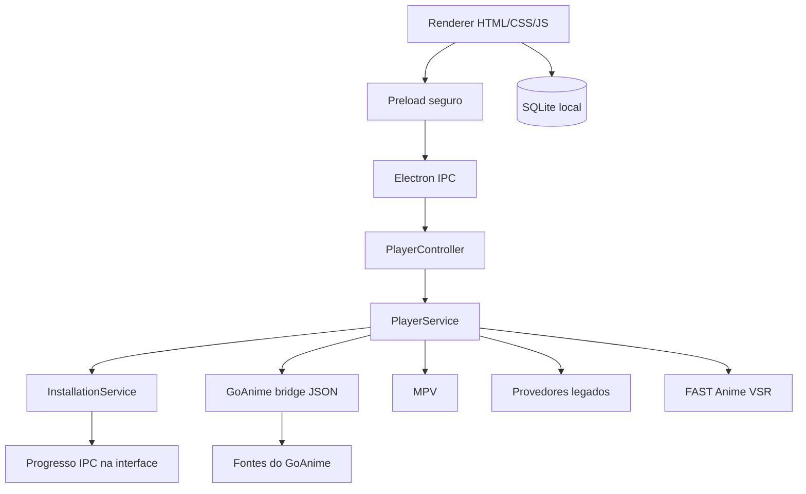

<div align="center">


<br>

[](#requisitos)
[](#tecnologias)
[](#tecnologias)
[](#tecnologias)
[](./CHANGELOG.md)
[](./LICENSE)

### Interface gráfica local para pesquisar animes com GoAnime e reproduzir no MPV.

</div>

---

## Visão geral

O **KitsuneDesk** é uma aplicação desktop para Windows construída com Electron, HTML, CSS, JavaScript puro, Bootstrap e SQLite.

Na versão 0.5.1, o fluxo principal mantém o seletor unificado de provedores e passa a instalar os componentes ausentes dentro da própria interface:

1. **GoAnime com interface gráfica** permanece como opção principal;
2. **GoAnime clássico** pode ser aberto pelo mesmo formulário;
3. anime-cli-br, ani-cli experimental e FAST Anime VSR aparecem no mesmo seletor;
4. idioma e resolução são escolhidos antes da execução;
5. **Melhor disponível** é a resolução selecionada por padrão;
6. instalações e reparos exibem porcentagem, etapa atual e a função de cada componente.

A interface possui:

- seletor de provedor na Home;
- idioma legendado ou dublado/PT-BR;
- resolução automática, 360p, 480p, 720p ou 1080p;
- botões para voltar à Home, aos resultados e pesquisar outro anime;
- filtro de episódios;
- atalhos avançados de instalação e reparo;
- painel gráfico de instalação, sem abrir PowerShell ou Windows Terminal;
- barra de progresso, monitor de eventos e estados “já instalado”, “instalando”, “aviso” e “erro”.

> O KitsuneDesk não hospeda conteúdo. Ele integra ferramentas e fontes externas instaladas no computador do usuário.

## GoAnime GUI

A busca gráfica utiliza um bridge local compilado a partir do código oficial do GoAnime. O bridge expõe somente operações estruturadas para o Electron:

```text
search   -> pesquisa e devolve resultados em JSON
episodes -> devolve episódios em JSON
stream   -> resolve a URL escolhida e devolve metadados
```

O bridge fica em:

```text
%LOCALAPPDATA%\KitsuneDesk\tools\goanime-bridge\goanime-bridge.exe
```

Para ativá-lo, selecione **GoAnime — Interface gráfica** e clique em **Instalar automaticamente**. O processo ocorre em segundo plano e instala somente o que estiver faltando:

1. GoAnime clássico;
2. MPV;
3. Scoop, quando necessário;
4. runtime Go portátil, apenas quando o bridge precisar ser compilado;
5. biblioteca compatível do GoAnime;
6. bridge gráfico local.

A tela mostra a porcentagem, a etapa atual, o que já estava instalado e para que serve cada componente. Nenhum terminal externo é aberto.

O GoAnime clássico continua disponível na área de ferramentas avançadas e também no seletor principal da Home.

### Reprodução na interface gráfica

A versão 0.5.1 mantém o mesmo resolvedor e o mesmo proxy de páginas intermediárias do GoAnime clássico antes de abrir o MPV. Isso é necessário principalmente para fontes PT-BR que entregam uma página do Blogger em vez de uma URL de vídeo direta. O KitsuneDesk também aguarda a inicialização do MPV antes de mostrar a confirmação de reprodução.

Ao atualizar de uma versão anterior, selecione **GoAnime — Interface gráfica** e use **Instalar automaticamente**. O KitsuneDesk preserva componentes válidos e recompila somente o bridge incompatível ou ausente.

## Provedores e ferramentas

| Componente | Uso | Situação |
|---|---|---|
| **GoAnime GUI** | Pesquisa, episódios e stream dentro do app | Principal e selecionado por padrão |
| **GoAnime clássico** | TUI original no terminal | Disponível no seletor principal |
| **anime-cli-br** | Fonte brasileira baseada em AnimeFire e VLC | Legado e manual |
| **ani-cli** | Provedor em Git Bash | Experimental e manual |
| **FAST Anime VSR** | Super-resolução de arquivos locais | Ferramenta opcional |

### anime-cli-br

A instalação automática cria um ambiente isolado com Python 3.12 em:

```text
%LOCALAPPDATA%\KitsuneDesk\tools\anime-cli-br\.venv
```

A instalação global feita anteriormente pelo Python 3.15 deixa de ser priorizada.

Antes de abrir o terminal, o KitsuneDesk verifica o DNS e a conexão HTTPS de `animefire.net`. Quando a fonte estiver indisponível, a aplicação mostra uma mensagem curta e não abre o traceback Python.

A indisponibilidade do domínio externo não pode ser corrigida pelo KitsuneDesk; nesse caso, use o GoAnime GUI.

### ani-cli

O ani-cli foi mantido no projeto e continua disponível manualmente. A qualidade é enviada no formato esperado:

```text
-q best
-q 720p
-q 1080p
```

O erro abaixo é tratado como problema externo conhecido:

```text
Episode is released, but no valid sources!
```

Quando isso acontecer, o terminal explica o problema e recomenda o GoAnime.

### FAST Anime VSR

FAST Anime VSR não é um provedor de streaming. Ele processa vídeos locais com super-resolução.

O preparador automático instala Python 3.10, FFmpeg, ambiente virtual, dependências do projeto e PyTorch. Ao final, verifica GPU NVIDIA e CUDA.

O ambiente base é concluído mesmo quando CUDA não está ativa. A aceleração depende do driver e da compatibilidade da GPU disponível na máquina.

## Instalação automática dos componentes

Os quatro grupos instaláveis usam o mesmo painel gráfico:

| Grupo | Instala automaticamente | Observação |
|---|---|---|
| **GoAnime completo** | GoAnime, MPV, Scoop, Go portátil e bridge GUI | Principal e recomendado |
| **anime-cli-br** | Python 3.12, VLC, código e bibliotecas | AnimeFire continua sendo uma fonte externa |
| **ani-cli experimental** | Scoop, Git Bash, fzf, FFmpeg, MPV, OpenSSL e ani-cli | O erro de fontes inválidas pode continuar upstream |
| **FAST Anime VSR** | Python 3.10, FFmpeg, dependências e PyTorch | CUDA depende do hardware e driver |

Os instaladores rodam com `windowsHide`, enviam eventos estruturados ao Electron e não abrem uma janela de terminal. O botão **Cancelar** encerra a árvore do processo; **Ocultar** mantém a instalação em segundo plano.

## Instalação para desenvolvimento

### Requisitos

- Windows 10 ou 11 x64;
- Node.js;
- npm;
- PowerShell;
- internet para os assistentes de instalação.

### Executar

```powershell
npm install
npm run dev
```

Login inicial:

```text
Usuário: admin
Senha: admin123
```

Na primeira entrada, o sistema exige a troca da senha.

## Build do Windows

```powershell
npm run build:win
```

O instalador será gerado em:

```text
dist\KitsuneDesk-Setup-0.5.1.exe
```

## Arquitetura



O renderer não recebe acesso direto a `fs`, `child_process`, banco de dados ou `ipcRenderer`.

## Estrutura principal

```text
kitsunedesk/
├── resources/
│   ├── goanime-bridge/main.go
│   └── licenses/
├── scripts/windows/
│   ├── install-provider.ps1
│   ├── install-goanime-gui.ps1
│   ├── install-anime-cli-br.ps1
│   ├── install-ani-cli.ps1
│   └── prepare-fast-anime-vsr.ps1
├── src/
│   ├── main/
│   │   ├── controllers/
│   │   ├── ipc/
│   │   └── services/
│   └── renderer/
│       ├── pages/
│       ├── css/
│       └── js/
├── package.json
└── electron-builder.yml
```

## Tecnologias

- Electron;
- JavaScript puro;
- HTML5 e CSS3;
- Bootstrap e Bootstrap Icons;
- SQLite com better-sqlite3;
- bcryptjs;
- MPV;
- GoAnime;
- PowerShell;
- electron-builder;
- ESLint e Prettier.

## Diagnóstico

### GoAnime GUI não está pronto

Clique em **Instalar automaticamente**. Acompanhe a barra de progresso dentro do KitsuneDesk; o status é atualizado quando o processo termina.

### anime-cli-br informa AnimeFire indisponível

O domínio não respondeu ao DNS ou HTTPS. Use GoAnime GUI e teste novamente mais tarde.

### ani-cli encontra o episódio, mas não reproduz

A fonte do ani-cli não entregou uma URL válida. Isso não impede o funcionamento do GoAnime GUI.

### FAST Anime VSR ainda não mostra CUDA pronta

O Python básico foi preparado, mas ainda faltam componentes compatíveis com a placa NVIDIA, principalmente PyTorch/CUDA.

## Licenças e projetos externos

Consulte [THIRD_PARTY.md](./THIRD_PARTY.md) e `resources/licenses/`.


### Correção do instalador gráfico no Windows PowerShell

A versão 0.5.1 corrige a transformação indevida do caminho do `go.exe` em uma coleção de mensagens de progresso. Também grava o script temporário com BOM UTF-8, garantindo acentuação correta no Windows PowerShell 5.1.
