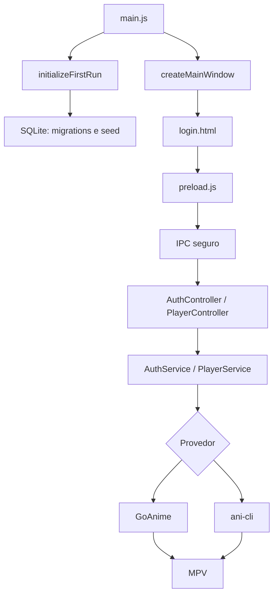

<div align="center">


<br>

[](#requisitos)
[](#tecnologias)
[](#tecnologias)
[](#tecnologias)
[](./LICENSE)

### Interface desktop local para pesquisar animes e abrir a reprodução no MPV usando GoAnime ou ani-cli.

[Visão geral](#visão-geral) •
[Fluxo](#fluxo-do-projeto) •
[Instalação](#instalação-e-execução) •
[Entendendo o código](#passo-a-passo-para-entender-o-projeto) •
[Build](#gerar-instalador) •
[Licença](#licença)

</div>

---

## Visão geral

O **KitsuneDesk** é uma aplicação desktop local para Windows, feita com Electron, JavaScript, HTML, CSS, Bootstrap e SQLite.

O projeto entrega uma interface gráfica para:

- fazer login local;
- trocar a senha inicial obrigatória;
- verificar se os provedores de reprodução estão instalados;
- instalar o GoAnime pela release oficial;
- pesquisar um anime pelo nome;
- escolher idioma e qualidade;
- abrir o provedor em um terminal interativo;
- reproduzir o episódio selecionado no MPV.

O provedor recomendado é o **GoAnime**. O **ani-cli** continua disponível como fallback opcional.

> O KitsuneDesk não hospeda, distribui nem armazena episódios. Ele apenas abre ferramentas externas no computador do usuário. A disponibilidade de conteúdo depende dos provedores externos, das fontes usadas por eles e dos direitos de acesso do usuário.

Repositório oficial:

```text
https://github.com/RaphaelTW/kitsuneDesk.git
```

## Fluxo do projeto

### Fluxo do usuário

1. O usuário abre o KitsuneDesk.
2. A tela inicial carrega `login.html`.
3. No primeiro acesso, entra com:

```text
Usuário: admin
Senha: admin123
```

4. O sistema exige uma nova senha.
5. Depois do login, a tela `home.html` verifica GoAnime, MPV e ani-cli.
6. Se o GoAnime não estiver instalado, o usuário pode clicar em **Instalar GoAnime**.
7. O app baixa o instalador mais recente das releases oficiais do GoAnime.
8. Após instalar, o usuário clica em **Atualizar status**.
9. O usuário pesquisa um anime, escolhe provedor, idioma e qualidade.
10. O KitsuneDesk abre uma janela de terminal com GoAnime ou ani-cli.
11. A escolha do título e do episódio acontece na interface interativa do provedor.
12. O MPV abre a reprodução.

### Fluxo técnico



O renderer não acessa Node.js diretamente. Ele usa apenas a API exposta por `preload.js` em `window.animeDesk`.

## Recursos atuais

- Aplicação desktop com Electron.
- Janela única com proteção contra múltiplas instâncias.
- `nodeIntegration: false`, `contextIsolation: true` e `sandbox: true`.
- Preload seguro com canais IPC permitidos.
- Login local com hash de senha usando `bcryptjs`.
- Bloqueio temporário após tentativas inválidas de login.
- Troca obrigatória da senha padrão.
- Banco SQLite local criado automaticamente.
- Migração inicial e seed do usuário administrador.
- Status visual de GoAnime, MPV e ani-cli.
- Modo automático com prioridade para GoAnime.
- Instalação assistida do GoAnime.
- Instalação assistida do fallback ani-cli via Scoop.
- Abertura do provedor em Windows Terminal, Prompt de Comando ou Git Bash.
- Build Windows com `electron-builder`.

## Tecnologias

| Camada | Tecnologia | Uso |
|---|---|---|
| Desktop | Electron | Janela, ciclo de vida e IPC |
| Runtime | Node.js | Processo principal e scripts |
| Interface | HTML, CSS e JavaScript | Telas do renderer |
| UI | Bootstrap e Bootstrap Icons | Componentes visuais locais |
| Banco | SQLite com `better-sqlite3` | Dados locais |
| Segurança | `bcryptjs` | Hash de senha |
| Provedor principal | GoAnime | Pesquisa interativa e reprodução |
| Fallback | ani-cli | Alternativa via Git Bash |
| Player | MPV | Reprodução de mídia |
| Build | electron-builder | Instalador Windows NSIS |
| Qualidade | ESLint e Prettier | Padronização do código |

## Requisitos

### Para desenvolvimento

- Windows 10 ou Windows 11.
- Git.
- Node.js LTS.
- npm.

### Para reprodução

Recomendado:

- GoAnime.
- MPV.

O instalador oficial do GoAnime inclui o MPV e pode adicionar ambos ao `PATH`.

Fallback opcional:

- Git Bash.
- ani-cli.
- fzf.
- ffmpeg.
- MPV.
- OpenSSL.
- Scoop, caso queira instalar o fallback automaticamente.

## Instalação e execução

### 1. Clonar o repositório

```powershell
git clone https://github.com/RaphaelTW/kitsuneDesk.git
cd kitsuneDesk
```

### 2. Instalar dependências

```powershell
npm install
```

O `postinstall` executa `npm run vendor`, que copia Bootstrap, Bootstrap Icons e licenças para as pastas usadas pelo renderer.

Se precisar rodar manualmente:

```powershell
npm run vendor
```

### 3. Rodar em desenvolvimento

```powershell
npm run dev
```

Esse comando copia os arquivos vendor e abre o Electron.

Também é possível iniciar sem copiar os vendors novamente:

```powershell
npm start
```

### 4. Fazer o primeiro login

```text
Usuário: admin
Senha: admin123
```

Depois do login, crie uma nova senha. A senha precisa ter:

- pelo menos 8 caracteres;
- uma letra maiúscula;
- uma letra minúscula;
- um número.

### 5. Instalar ou verificar o GoAnime

Na tela principal:

1. Clique em **Instalar GoAnime**.
2. Aguarde o script abrir o instalador oficial.
3. Autorize a instalação como administrador, se o Windows solicitar.
4. Mantenha marcada a opção para adicionar GoAnime e MPV ao `PATH`.
5. Finalize o instalador.
6. Volte ao KitsuneDesk.
7. Clique em **Atualizar status**.

Instalação manual:

```text
https://github.com/alvarorichard/GoAnime/releases/latest
```

### 6. Pesquisar e reproduzir

1. Selecione **Automático**, **GoAnime** ou **ani-cli**.
2. Digite o nome do anime.
3. Escolha **Legendado** ou **Dublado / PT-BR**.
4. Escolha a qualidade.
5. Clique em **Abrir**.
6. Use a interface interativa do provedor para escolher resultado e episódio.
7. O MPV será aberto automaticamente.

## Provedores

### Automático

O modo automático resolve o provedor nesta ordem:

1. Usa GoAnime quando GoAnime e MPV estão prontos.
2. Usa ani-cli quando o GoAnime não está pronto e o fallback está completo.
3. Mostra uma mensagem de dependências pendentes se nenhum provedor estiver pronto.

### GoAnime

O KitsuneDesk procura o GoAnime em locais como:

```text
C:\Program Files\GoAnime\goanime.exe
C:\Program Files (x86)\GoAnime\goanime.exe
%LOCALAPPDATA%\Programs\GoAnime\goanime.exe
%LOCALAPPDATA%\GoAnime\goanime.exe
%USERPROFILE%\go\bin\goanime.exe
resources\goanime\goanime.exe
```

Também procura o MPV no `PATH`, no Scoop, em `resources\mpv` e no caminho incluído pelo GoAnime:

```text
C:\Program Files\GoAnime\bin\mpv.exe
```

Mapeamento dos filtros para o GoAnime:

| KitsuneDesk | GoAnime |
|---|---|
| Melhor disponível | `--quality best` |
| 360p | `--quality 360p` |
| 480p | `--quality 480p` |
| 720p | `--quality 720p` |
| 1080p | `--quality 1080p` |
| Legendado | Pesquisa nas fontes ativas |
| Dublado / PT-BR | `--source ptbr` |

Exemplo de comando gerado:

```powershell
goanime --quality best --source ptbr "Naruto"
```

### ani-cli

O ani-cli é fallback opcional. A instalação assistida executa comandos equivalentes a:

```powershell
scoop install git
scoop bucket add extras
scoop install ani-cli fzf ffmpeg mpv openssl
```

No uso normal, o KitsuneDesk abre o ani-cli pelo Git Bash e mantém o terminal aberto para exibir mensagens de erro.

## Passo a passo para entender o projeto

Se você está chegando agora no código, siga esta ordem:

1. Abra `package.json`.

Veja o nome do app, versão, scripts disponíveis, dependências e o ponto de entrada em `src/main/main.js`.

2. Leia `src/main/main.js`.

Ele configura diretório de dados opcional, garante instância única, inicializa banco, registra IPC e cria a janela principal.

3. Leia `src/main/windowManager.js`.

Esse arquivo cria a janela Electron, carrega `login.html`, configura o preload e bloqueia navegação externa indevida.

4. Leia `src/main/preload.js`.

Aqui fica a fronteira segura entre renderer e processo principal. O renderer só chama métodos expostos em `window.animeDesk`.

5. Leia a autenticação.

Arquivos principais:

```text
src/main/ipc/registerAuthHandlers.js
src/main/controllers/authController.js
src/main/services/authService.js
src/main/repositories/userRepository.js
src/renderer/js/login.js
src/renderer/js/change-password.js
```

Esse fluxo valida login, compara senha com hash, cria sessão em memória e exige troca da senha inicial.

6. Leia o banco local.

Arquivos principais:

```text
src/main/database/connection.js
src/main/database/migrations.js
src/main/database/seed.js
src/main/database/nativeDatabaseClient.js
src/main/database/databaseBridge.js
```

O app tenta usar `better-sqlite3` diretamente. Se isso falhar em desenvolvimento, usa um worker Node como ponte.

7. Leia o player.

Arquivos principais:

```text
src/main/ipc/registerPlayerHandlers.js
src/main/controllers/playerController.js
src/main/services/playerService.js
src/renderer/js/home.js
```

Esse é o coração da integração com GoAnime, MPV e ani-cli.

8. Leia as telas.

```text
src/renderer/pages/login.html
src/renderer/pages/change-password.html
src/renderer/pages/home.html
src/renderer/css/
src/renderer/js/
```

As telas usam JavaScript ES Modules, Bootstrap local e CSP restritiva.

9. Leia os scripts e build.

```text
scripts/start-electron.js
scripts/copy-vendor.js
electron-builder.yml
```

Esses arquivos explicam como o app é iniciado em desenvolvimento, como os assets de terceiros são copiados e como o instalador é gerado.

## Estrutura

```text
kitsuneDesk/
├── assets/                         # Logo, banner e imagens de preview
├── resources/
│   ├── goanime/                    # Espaço para binário portátil do GoAnime
│   ├── mpv/                        # Espaço para MPV portátil
│   └── licenses/                   # Licenças de terceiros
├── scripts/
│   ├── copy-vendor.js              # Copia Bootstrap e Bootstrap Icons
│   └── start-electron.js           # Inicia o Electron
├── src/
│   ├── main/
│   │   ├── controllers/            # Controllers chamados pelo IPC
│   │   ├── database/               # SQLite, migrações e seed
│   │   ├── ipc/                    # Registro dos canais IPC
│   │   ├── repositories/           # Acesso aos dados
│   │   ├── services/               # Regras de autenticação e player
│   │   ├── utils/                  # Erros, logs, paths e validação
│   │   ├── main.js                 # Entrada do processo principal
│   │   ├── preload.js              # API segura para o renderer
│   │   └── windowManager.js        # Criação da janela
│   └── renderer/
│       ├── css/                    # Estilos das telas
│       ├── js/                     # Lógica do renderer
│       ├── pages/                  # HTML das telas
│       └── vendor/                 # Dependências visuais copiadas
├── CHANGELOG.md
├── electron-builder.yml
├── LICENSE
├── package.json
└── README.md
```

## Scripts

| Comando | Função |
|---|---|
| `npm run dev` | Copia vendors e abre o Electron |
| `npm start` | Abre o Electron |
| `npm run vendor` | Copia Bootstrap, Bootstrap Icons e licenças |
| `npm run lint` | Executa ESLint |
| `npm run lint:fix` | Corrige problemas automáticos do ESLint |
| `npm run format` | Formata o projeto com Prettier |
| `npm run format:check` | Verifica formatação |
| `npm run build` | Gera build com electron-builder |
| `npm run build:win` | Gera instalador Windows |

## Banco de dados local

O banco é criado automaticamente na pasta de dados do Electron, dentro de:

```text
database/kitsunedesk.sqlite
```

Tabelas criadas pela migração inicial:

- `users`
- `settings`
- `watch_history`
- `playback_sessions`
- `application_logs`
- `schema_migrations`

Para isolar dados em testes manuais, defina:

```powershell
$env:KITSUNEDESK_USER_DATA_DIR="H:\temp\kitsunedesk-dev-data"
npm run dev
```

## Segurança

O KitsuneDesk usa uma separação simples e importante:

- o processo principal acessa Node.js, banco e comandos do sistema;
- o renderer exibe a interface;
- o preload expõe apenas métodos permitidos;
- o renderer não recebe `require`, `fs`, `child_process` nem `ipcRenderer` completo;
- navegações externas são bloqueadas e links HTTP/HTTPS são abertos pelo navegador do sistema;
- as telas usam Content Security Policy local.

Configuração central da janela:

```javascript
webPreferences: {
  preload: preloadPath,
  nodeIntegration: false,
  contextIsolation: true,
  sandbox: true
}
```

## Gerar Instalador

Para gerar o instalador Windows:

```powershell
npm run build:win
```

A saída fica em:

```text
dist/
```

O artefato segue o padrão:

```text
KitsuneDesk-Setup-0.2.0.exe
```

O instalador do KitsuneDesk não redistribui automaticamente GoAnime ou MPV. O usuário pode instalar o GoAnime pelo botão dentro do app ou manualmente pela página oficial do projeto.

## Solução de problemas

### GoAnime aparece como não instalado

Verifique:

```powershell
where.exe goanime
Test-Path "C:\Program Files\GoAnime\goanime.exe"
```

Depois clique em **Atualizar status** no KitsuneDesk.

### MPV não encontrado

Verifique:

```powershell
where.exe mpv
Test-Path "C:\Program Files\GoAnime\bin\mpv.exe"
```

Se o MPV estiver ausente, reinstale o GoAnime mantendo a opção de adicionar GoAnime e MPV ao `PATH`.

### Terminal fecha ou mostra erro

O KitsuneDesk cria scripts temporários para abrir GoAnime ou ani-cli. A janela deve permanecer aberta para mostrar o código de saída.

Teste o provedor manualmente:

```powershell
goanime "Naruto"
goanime -h
goanime --update
```

### Fallback ani-cli incompleto

Instale pelo botão **Instalar fallback ani-cli** ou rode:

```powershell
scoop install git
scoop bucket add extras
scoop install ani-cli fzf ffmpeg mpv openssl
```

### Quero limpar os dados locais em desenvolvimento

Use uma pasta temporária com `KITSUNEDESK_USER_DATA_DIR` ou remova a pasta de dados criada pelo Electron para o app. Ao abrir novamente, o banco será recriado com o usuário padrão.

## Roadmap

- [x] Aplicação Electron com preload seguro.
- [x] Login local.
- [x] SQLite automático.
- [x] Troca obrigatória da senha inicial.
- [x] Integração com GoAnime.
- [x] Instalação assistida do GoAnime.
- [x] Fallback opcional com ani-cli.
- [x] Status visual de dependências.
- [ ] Listar resultados diretamente dentro da interface.
- [ ] Listar episódios diretamente dentro da interface.
- [ ] Integrar histórico de reprodução à tela.
- [ ] Controlar MPV por JSON IPC.
- [ ] Adicionar próximo episódio pela interface do KitsuneDesk.

## Licença

O KitsuneDesk usa a licença **MIT**.

Veja o arquivo [`LICENSE`](./LICENSE).

Licenças de terceiros ficam em [`resources/licenses`](./resources/licenses).

O GoAnime é um projeto independente e também possui licença própria. Uma cópia está em:

```text
resources/licenses/GoAnime-LICENSE.txt
```

## Uso responsável

Use o KitsuneDesk apenas com fontes e conteúdos aos quais você tenha direito de acesso. Respeite direitos autorais, termos de serviço e a legislação aplicável.

<div align="center">


### KitsuneDesk 0.2.0

**GoAnime primeiro. ani-cli como fallback.**

</div>
