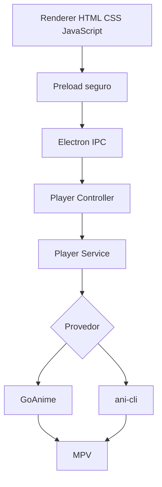

<div align="center">


<br>

[](#-requisitos)
[](#-tecnologias)
[](#-integração-com-goanime)
[](#-tecnologias)
[](#-tecnologias)
[](./LICENSE)

### Interface gráfica local para abrir o GoAnime e reproduzir animes no MPV.

Pesquise pelo nome, escolha o idioma e a qualidade e deixe o KitsuneDesk abrir o fluxo interativo do GoAnime sem precisar decorar comandos.

[Visão geral](#-visão-geral) •
[GoAnime](#-integração-com-goanime) •
[Instalação](#-instalação) •
[Uso](#-como-usar) •
[Estrutura](#-estrutura) •
[Solução de problemas](#-solução-de-problemas)

</div>

---

## 🦊 Visão geral

O **KitsuneDesk** é um aplicativo desktop local para Windows desenvolvido com Electron, HTML, CSS, JavaScript puro, Bootstrap e SQLite.

A versão `0.2.0` utiliza o **GoAnime como provedor principal** e mantém o **ani-cli como fallback opcional**.

O usuário faz a pesquisa pela interface gráfica. Em seguida, o KitsuneDesk abre automaticamente a interface interativa do provedor selecionado para escolher o resultado e o episódio.

> O KitsuneDesk não hospeda conteúdo. A disponibilidade depende das fontes consultadas pelos provedores externos e dos direitos de acesso do usuário.

---

## ✨ Recursos atuais

- Login local com senha protegida por hash.
- Troca obrigatória da senha no primeiro acesso.
- Banco SQLite criado automaticamente.
- Interface gráfica em HTML, CSS, JavaScript e Bootstrap.
- Provedor automático com prioridade para GoAnime.
- GoAnime como provedor recomendado.
- ani-cli como fallback opcional.
- Pesquisa direta pelo nome do anime.
- Filtro Legendado ou Dublado / PT-BR.
- Qualidade automática, 360p, 480p, 720p ou 1080p.
- Detecção automática do GoAnime e do MPV.
- Instalação do GoAnime pelo instalador oficial do GitHub Releases.
- Instalação assistida do ani-cli e dependências pelo Scoop.
- Execução em Windows Terminal ou Prompt de Comando.
- Electron com `nodeIntegration: false`, `contextIsolation: true` e preload seguro.

---

## 🎌 Integração com GoAnime

O [GoAnime](https://github.com/alvarorichard/GoAnime) é uma aplicação TUI desenvolvida em Go que permite pesquisar títulos e reproduzir ou baixar episódios pelo MPV.

Segundo a documentação oficial, ele oferece:

- busca de animes, filmes e séries;
- pesquisa simultânea nas fontes ativas;
- conteúdo legendado e dublado em português e inglês;
- qualidade selecionável;
- integração com MPV;
- histórico e retomada de reprodução em SQLite.

### Comandos gerados pelo KitsuneDesk

Pesquisa legendada utilizando as fontes ativas:

```powershell
goanime --quality best "Naruto"
```

Pesquisa Dublado / PT-BR:

```powershell
goanime --quality best --source ptbr "Naruto"
```

Qualidade específica:

```powershell
goanime --quality 1080p "Naruto"
```

O usuário não precisa digitar esses comandos. Eles são montados e executados pelo KitsuneDesk.

### Mapeamento da interface

| KitsuneDesk | GoAnime |
|---|---|
| Melhor disponível | `--quality best` |
| 360p | `--quality 360p` |
| 480p | `--quality 480p` |
| 720p | `--quality 720p` |
| 1080p | `--quality 1080p` |
| Legendado | Pesquisa nas fontes ativas |
| Dublado / PT-BR | `--source ptbr` |

---

## 🧭 Seleção de provedor

A tela principal possui três opções:

### Automático

1. Usa GoAnime quando ele estiver instalado.
2. Se o GoAnime estiver indisponível, tenta o ani-cli.
3. Se nenhum estiver pronto, mostra os botões de instalação.

### GoAnime

Força o uso do GoAnime. Requer:

- `goanime.exe`;
- MPV instalado ou incluído pelo instalador oficial.

### ani-cli

Fallback opcional. Requer:

- Git Bash;
- ani-cli;
- fzf;
- ffmpeg;
- MPV;
- OpenSSL recomendado.

---

## 🧰 Tecnologias

| Camada | Tecnologia | Função |
|---|---|---|
| Desktop | Electron | Janela e integração com Windows |
| Interface | HTML5 + CSS3 | Estrutura e visual |
| Componentes | Bootstrap 5 | Grid, formulários e botões |
| Comportamento | JavaScript ES Modules | Lógica do renderer |
| Processo principal | Node.js | IPC, banco e execução dos provedores |
| Banco | SQLite + better-sqlite3 | Dados locais |
| Segurança | bcryptjs | Hash de senha |
| Provedor principal | GoAnime | Pesquisa e seleção interativa |
| Provedor alternativo | ani-cli | Fallback pelo Git Bash |
| Player | MPV | Reprodução de mídia |
| Build | electron-builder | Geração do instalador Windows |

---

## ✅ Requisitos

### Desenvolvimento

- Windows 10 ou Windows 11.
- Node.js.
- npm.
- Git.

### Execução com GoAnime

O instalador oficial do GoAnime inclui o MPV e oferece a opção de adicionar ambos ao PATH.

Caminhos detectados automaticamente:

```text
C:\Program Files\GoAnime\goanime.exe
C:\Program Files\GoAnime\bin\mpv.exe
```

O KitsuneDesk também procura instalações feitas com:

```powershell
go install github.com/alvarorichard/Goanime/cmd/goanime@latest
```

---

## 🚀 Instalação

### 1. Instalar as dependências Node

Abra o terminal dentro da pasta do projeto:

```powershell
npm install
```

### 2. Executar em desenvolvimento

```powershell
npm run dev
```

### 3. Entrar no sistema

Primeiro acesso:

```text
Usuário: admin
Senha: admin123
```

O sistema solicita a troca da senha inicial.

### 4. Instalar o GoAnime

Na tela principal:

1. Clique em **Instalar GoAnime**.
2. Aguarde o download da release oficial.
3. Autorize a execução como administrador.
4. Mantenha marcada a opção **Add GoAnime and MPV to PATH**.
5. Finalize o instalador.
6. Volte ao KitsuneDesk.
7. Clique em **Atualizar status**.

O botão utiliza a API oficial de releases para localizar o instalador Windows mais recente.

### Instalação manual do GoAnime

Baixe o instalador em:

```text
https://github.com/alvarorichard/GoAnime/releases/latest
```

---

## ▶️ Como usar

1. Execute:

```powershell
npm run dev
```

2. Faça login.
3. Na tela principal, selecione **Automático** ou **GoAnime**.
4. Digite o nome do anime.
5. Escolha Legendado ou Dublado / PT-BR.
6. Escolha a qualidade.
7. Clique em **Abrir**.
8. Use as setas na TUI do GoAnime para selecionar o resultado.
9. Pressione `Enter`.
10. Escolha o episódio e confirme.
11. O MPV será aberto automaticamente.

---

## 🏗️ Arquitetura



### Segurança do Electron

```javascript
webPreferences: {
  preload: preloadPath,
  nodeIntegration: false,
  contextIsolation: true,
  sandbox: true
}
```

O renderer não recebe acesso direto a:

- `require`;
- `child_process`;
- `fs`;
- banco de dados;
- `ipcRenderer` completo.

---

## 📁 Estrutura

```text
kitsunedesk/
├── src/
│   ├── main/
│   │   ├── controllers/
│   │   ├── database/
│   │   ├── ipc/
│   │   ├── repositories/
│   │   ├── services/
│   │   ├── utils/
│   │   ├── main.js
│   │   ├── preload.js
│   │   └── windowManager.js
│   └── renderer/
│       ├── css/
│       ├── js/
│       ├── pages/
│       └── vendor/
├── resources/
│   ├── goanime/
│   ├── mpv/
│   └── licenses/
├── scripts/
├── assets/
├── package.json
├── electron-builder.yml
└── README.md
```

---

## 📜 Scripts

```bash
npm run dev
npm start
npm run lint
npm run lint:fix
npm run format
npm run format:check
npm run build
npm run build:win
```

---

## 📦 Gerar instalador do KitsuneDesk

```powershell
npm run build:win
```

Saída esperada:

```text
dist/
├── KitsuneDesk Setup.exe
└── win-unpacked/
```

O instalador do KitsuneDesk não redistribui automaticamente o executável do GoAnime. O usuário pode instalá-lo pelo botão oficial dentro do aplicativo.

---

## 🧯 Solução de problemas

### GoAnime aparece como não instalado

Confirme:

```powershell
where.exe goanime
Test-Path "C:\Program Files\GoAnime\goanime.exe"
```

Depois clique em **Atualizar status**.

### MPV não encontrado

Confirme:

```powershell
where.exe mpv
Test-Path "C:\Program Files\GoAnime\bin\mpv.exe"
```

Se estiver ausente, reinstale o GoAnime e mantenha selecionada a opção de incluir o MPV.

### O terminal fecha imediatamente

O KitsuneDesk executa o GoAnime por um script temporário `.cmd` e mantém a janela aberta após o término para exibir o código de saída.

### Quero testar o GoAnime sem o KitsuneDesk

```powershell
goanime "Naruto"
```

Atualização manual:

```powershell
goanime --update
```

Ajuda:

```powershell
goanime -h
```

### Fallback ani-cli incompleto

Clique em **Instalar fallback ani-cli** ou execute:

```powershell
scoop install git
scoop bucket add extras
scoop install ani-cli fzf ffmpeg mpv openssl
```

---

## 🗺️ Roadmap

- [x] Electron com preload seguro.
- [x] Login local.
- [x] SQLite automático.
- [x] Pesquisa por ani-cli.
- [x] Integração principal com GoAnime.
- [x] Instalador oficial do GoAnime pelo aplicativo.
- [x] Provedor automático com fallback.
- [ ] Capturar resultados diretamente na interface gráfica.
- [ ] Lista visual de episódios sem TUI externa.
- [ ] Controle do MPV por JSON IPC.
- [ ] Histórico integrado do KitsuneDesk.
- [ ] Próximo episódio pela interface do KitsuneDesk.

---

## 📄 Licenças

O KitsuneDesk utiliza a licença MIT disponível em [`LICENSE`](./LICENSE).

O GoAnime possui licença MIT própria. Uma cópia está disponível em:

```text
resources/licenses/GoAnime-LICENSE.txt
```

GoAnime é um projeto independente criado por seus respectivos autores.

---

## ⚖️ Uso responsável

O KitsuneDesk não hospeda, distribui ou armazena episódios.

Use o aplicativo somente com fontes e conteúdos aos quais você tenha direito de acesso. Respeite direitos autorais, termos de serviço e a legislação aplicável.

---

<div align="center">


### KitsuneDesk 0.2.0

**GoAnime primeiro. ani-cli como fallback.**

</div>
